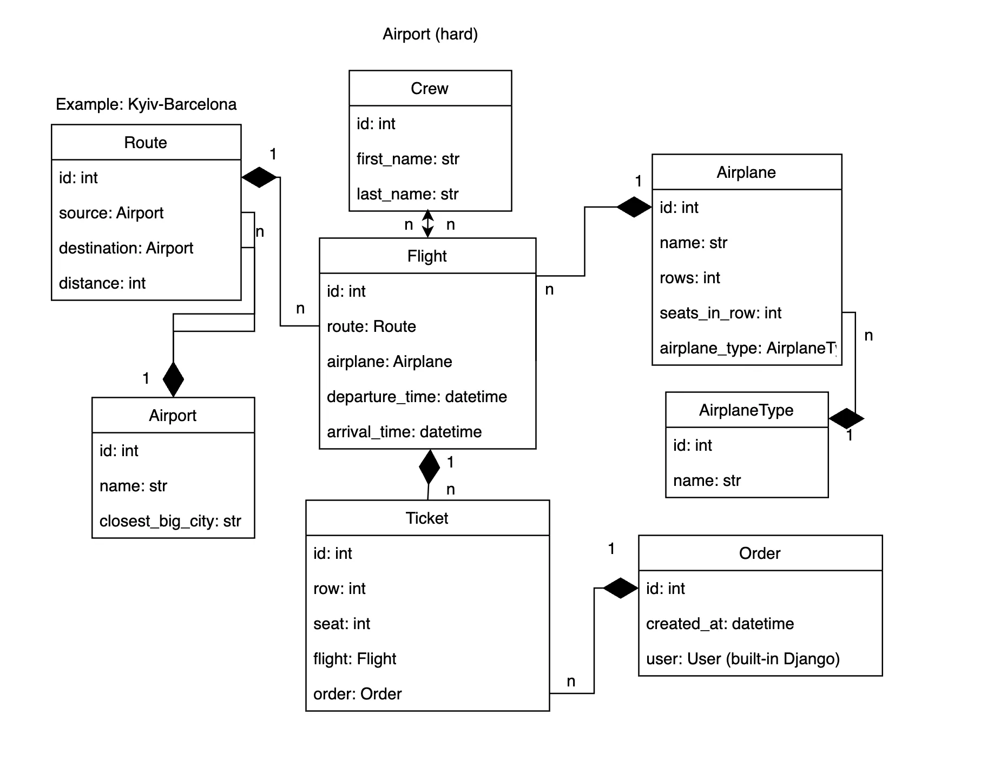

# Airport Management

## Description
A web-based application for managing flights, airplanes, routes, crew assignments,
and providing users with the ability to book tickets.

## Features
- JWT authentication for secure API access.
- Comprehensive API documentation available at:
   - /api/doc/swagger/ (Swagger UI)
   - /api/doc/redoc/ (ReDoc)
- Manage airplanes, flight schedules, and seat configurations.
- Assign crew members to flights.
- Track international routes and airports.
- User interface for browsing available flights and booking tickets easily.

## Technologies Used
- **Backend:** Django Framework
- **Database:** PostgreSQL
- **API:** Django REST Framework

## Installation
### Python 3 must be installed
1. **Clone the repository:**
   ```bash
   git clone https://github.com/01https/api-airport.git
2. **Create and activate a virtual environment:**
   ```bash
   python -m venv venv
   source venv/bin/activate  # For Linux/Mac
   venv\Scripts\activate  # For Windows
3. **Install dependencies:**
    ```bash
   pip install -r requirements.txt
4. **Create a .env file:**
   ```bash
   cp env.sample .env
   ```
   - Open the .env file and fill in the required environment variables
   (e.g., SECRET_KEY, DEBUG, POSTGRES_USER, POSTGRES_PASSWORD, POSTGRES_DB, etc.).
   - **Important:** Since the database runs in a Docker container, set
   POSTGRES_HOST to the service name defined in your docker-compose.yml (for example, db).
5. **Start the database container:** Since the database is running
in a Docker container, start it using Docker Compose:
   ```bash
   docker-compose up -d db
   ```
   This will launch the PostgreSQL container in detached mode.
6. **Apply database migrations:** With the database container running, execute:
    ```bash
   python manage.py migrate
7. **Create a superuser (for accessing the admin panel):**
   ```bash
   python manage.py createsuperuser
8. **Start the development server:**
    ```bash
   python manage.py runserver
   
## Containerized Deployment (For Full Environment)

1. **Create and configure the .env file:**
   ```bash
   cp env.sample .env
2. **Build and run the containers:**
   ```bash
   docker-compose up --build
   ```
   This command will build the Docker images and start the
   containers for the web application and PostgreSQL database.

## Diagram
